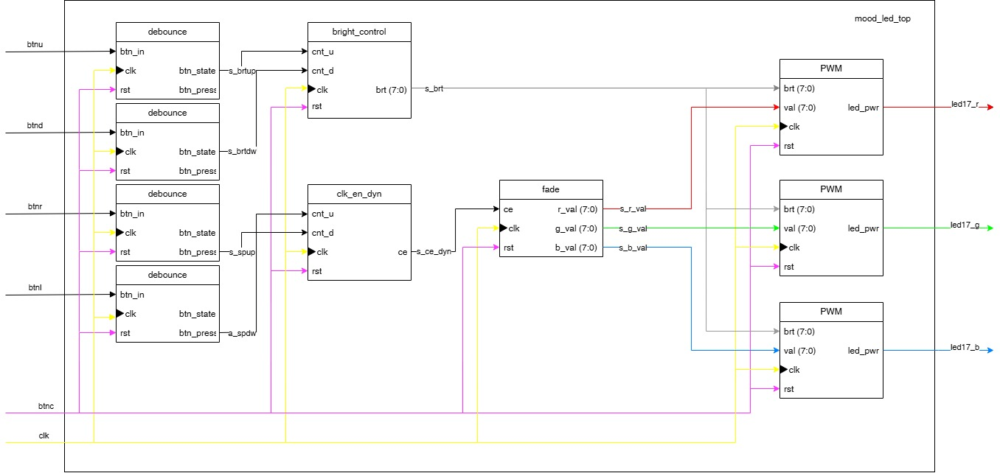
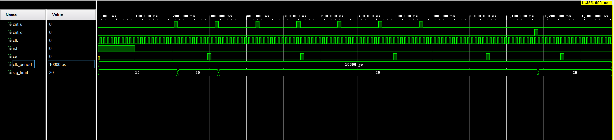
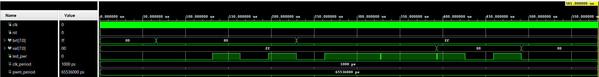
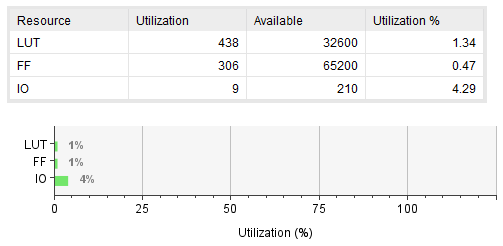

# Digital Electronics 1 Project: RGB mood lamp

## Problem Description
VHDL code for RGB lamp to enlighten your day. Fading colours in colour wheel loop with adjustable brightness and speed of colour change. Designed for Nexys A7-50T board utilizing RGB LED and 5 buttons.

---

## Team & Git Flow
The project tasks and module development were divided among the team members as follows:

| Team Member | Responsibilities / Modules Developed |
| :--- | :--- |
| [**Ondřej Kovář**](https://github.com/Ondrej-Kovar) | README, block diagram, PWM and bright_control modules |
| [**Richard Královský**](https://github.com/rkralovsky) | simulations, clk_en_dyn, fade, toplevel modules, implementaition |

You can view the full activity and contributions of all team members in our [Commit History](https://github.com/Ondrej-Kovar/DE1-project/commits/main).

---

## Block Diagram
The following diagram illustrates the hierarchy of VHDL modules and the signal flow between the top level and individual components.

---

## Inputs and Outputs

| Signal Name | Direction | Width | Description |
|:--- |:---:|:---:|:--- |
| **clk** | Input | 1 | System clock 100 MHz |
| **btnc** | Input | 1 | System reset |
| **btnu** | Input | 1 | Increase bightness |
| **btnd** | Input | 1 | Decrease bightness |
| **btnr** | Input | 1 | Increase fading speed |
| **btnl** | Input | 1 | Decrease fading speed |
| **led_17r** | Output | 1 | Red PWM supply |
| **led_17g** | Output | 1 | Green PWM supply |
| **led_17b** | Output | 1 | Blue PWM supply |

---

## New Blocks and Simulations 

### Bright_control

This block manages brightness using an up-down counter with an integrated auto-repeat function. It supports both single-step adjustments via button presses and smooth transitions when a button is held. The module includes saturation logic to prevent overflow and defaults to 50% brightness upon reset. The resulting 8-bit vector serves as a global intensity control for all PWM blocks.

### Clk_en_dyn

  Modified version of clk_en using an up-down counter, which allows us to control how often the signal is sent to the Fade block, effectively changing the speed of colour fading. Pressing the LEFT button increases the counter's threshold, therefore slowing down the fading, and vice versa. There are 9 speed modes in total. The output frequency ranges from 111 Hz to 1000 Hz with default frequency of 200 Hz.

### Fade

  A block utilizing a fading algorithm where colours transition smoothly around the colour wheel. In each state, one colour is at its minimum value (0), the second is at its maximum (255), and the third is either incremented or decremented by 1 with each pulse from Clk_en_dyn. There are six states in total. An internal counter ensures the correct sequence of colours. Full cycle requires 6*255=1530 input pulses from Clk_en_dyn. Outputs are 3 unique 8-bit vectors - one for each colour.

### PWM

  This module implements a PWM generator with an integrated hardware multiplier. It calculates the duty cycle by multiplying two 8-bit inputs: global brightness and colour value. The resulting 16-bit product allows for high-resolution dimming with 2^16 (65,536) discrete steps. Any changes to the input values do not take effect until the start of the next PWM period. This is achieved by latching the calculated duty cycle into a shadow register once the counter reaches its maximum value.
  
---
## Resource report
  

  Utilization of resources after synthesis.
  
---

## Vivado Project
The complete [project folder](./mood_led) is configured for **Vivado 2025.2**.
* **xpr file:** [mood_led.xpr](./mood_led/mood_led.xpr)
* **Source files:** Located in the [srcs](./mood_led/mood_led.srcs) directory.

**To run the project:**
1. Clone the repository.
2. Open Vivado 2025.2.
3. Select `Open Project` and point to the `.xpr` file in the root directory.

---

## Other Outputs

* **A3 Poster:** [PDF](./poster.pdf)
* **Video demonstration:** [video](./video.MP4)

### Tools & References
* **Software:** Vivado 2025.2
* **References:** [Digital Electronics 1 Repository](https://github.com/tomas-fryza/digital-electronics-1)
* **Test Benches** Generated via Gemini

---

