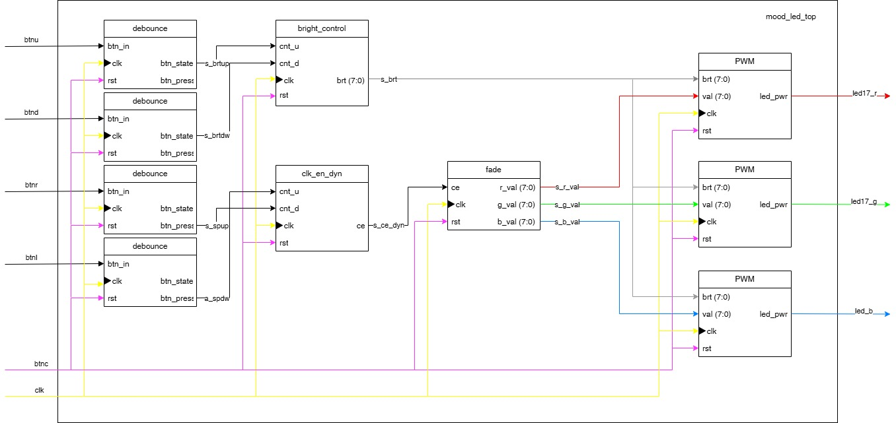
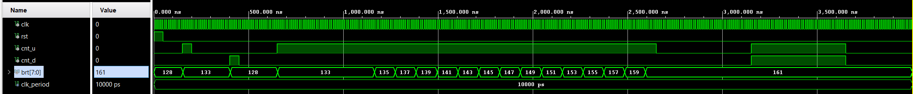
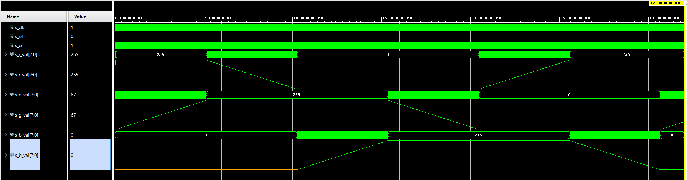
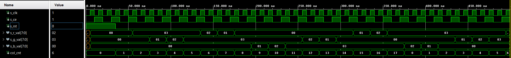

# Digital Electronics 1 Project: RGB mood lamp

## Problem Description
VHDL code for RGB lamp to enlighten your day. Fading colours in colour wheel loop with adjustable brightness and speed of colour change. Designed for Nexys A7-50T board utilizing RGB LED and 5 buttons.

---

## Team & Git Flow
The project tasks and module development were divided among the team members as follows:

| Team Member | Responsibilities / Modules Developed |
| :--- | :--- |
| [**Ondřej Kovář**](https://github.com/Ondrej-Kovar) | README, block diagram, PWM and bright_control modules |
| [**Richard Královský**](https://github.com/rkralovsky) | simulations, clk_en_dyn, fade, toplevel modules, implementaition |

You can view the full activity and contributions of all team members in our [Commit History](https://github.com/Ondrej-Kovar/DE1-project/commits/main).

---

## Block Diagram
The following diagram illustrates the hierarchy of VHDL modules and the signal flow between the top level and individual components.

---

## Inputs and Outputs

| Signal Name | Direction | Width | Description |
|:--- |:---:|:---:|:--- |
| **clk** | Input | 1 | System clock 100 MHz |
| **btnc** | Input | 1 | System reset |
| **btnu** | Input | 1 | Increase bightness |
| **btnd** | Input | 1 | Decrease bightness |
| **btnr** | Input | 1 | Increase fading speed |
| **btnl** | Input | 1 | Decrease fading speed |
| **led_17r** | Output | 1 | Red PWM supply |
| **led_17g** | Output | 1 | Green PWM supply |
| **led_17b** | Output | 1 | Blue PWM supply |

---

## New Blocks and Simulations 

### Bright_control

  This simulation verifies desired module function. On every rising edge of clk if only one of button inputs is on rising edge, output (8 bit number) is incremented. If both inputs are on rising edge, nothing happens, if either of buttons is held, after some time, output number is incremented periodically.

### Clk_en_dyn

  This simulation verifies that this module works similary like bright_control combined with clasical clock enable. Rising edges of clk are counted, overflow of counter releases output pulse. Button input increments counter capacity changing frequency of output signal.

### Fade

  First simulation shows how output signals looklike along each other, one is maximized, second is increasing/decreasing, third is minimized. Second simulation show full cycle of fading colours in comparison to module's inner counter. 

### PWM

   Simulation verifies duty cycle is changing based on both input vaules and period is constant. Change of input values doesn't take effect until new period.
  
---

## Vivado Project
The complete project folder is configured for **Vivado 2025.2**.
* **Source files:** Located in the `src/` directory.
* **Testbenches:** Located in the `sim/` directory.

**To run the project:**
1. Clone the repository.
2. Open Vivado 2025.2.
3. Select `Open Project` and point to the `.xpr` file in the root directory.

---

## Other Outputs

* ** A3 Poster:** [Link to your poster PDF](./poster.pdf)

### Tools & References
* **Software:** Vivado 2025.2
* **References:** * [Digital Electronics 1 Repository](https://github.com/tomas-fryza/digital-electronics-1)
* **Test Benches** Generated via Gemini AI

---

